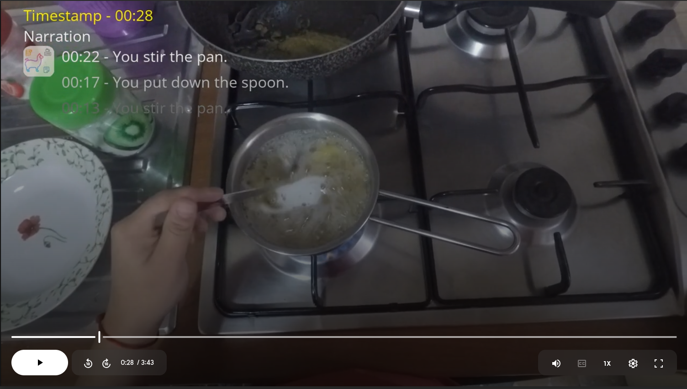

#  FlowNar: Scalable Streaming Narration for Long-Form Videos

<a href="https://icml.cc/Conferences/2026"></a>
<a href="ARXIV_LINK"></a>
<a href="https://zeyun-zhong.github.io/FlowNar/"></a>
<a href="https://huggingface.co/datasets/zeyun-zhong/FlowNar-Data/tree/main"></a>
<a href="LICENSE"></a>

[Zeyun Zhong](mailto:zeyun.zhong@kit.edu)\*, [Manuel Martin](), [Chengzhi Wu](), [David Schneider](), [Frederik Diederichs](), [Juergen Gall](), [Juergen Beyerer]()

*Karlsruhe Institute of Technology (KIT) &nbsp;·&nbsp; Fraunhofer IOSB &nbsp;·&nbsp; Lamarr Institute &nbsp;·&nbsp; University of Bonn*

---

## Demo

[](https://drive.google.com/file/d/1aT5tbPAp4gqZyxFVCH-6T4PUi1lWX0PW/view?usp=drive_link)

*FlowNar generates dense, temporally grounded narrations for a continuous video stream in real time. Unlike prior work, its VRAM usage stays bounded regardless of video length.*

---

## Introduction

Our paper presents a scalable approach for streaming video narration, introducing several interesting features:
- **Dynamic Context Management (DCM).** Prunes the visual KV cache after each narration segment, preventing unbounded context growth and reducing error propagation from potentially misaligned history. 
It then uses a streaming memory (CLAM) to iteratively compress visual information from processed segments into a fixed-size set of memory tokens, providing O(1) memory usage and per-step computational complexity for historical visual frames.

- **Self-conditioned evaluation protocol.** An autoregressive pipeline where the model generates narrations conditioned on its own previous outputs, enabling deployment-like assessment beyond standard teacher-forcing evaluation.

---

## Repository Structure

```
FlowNar/
├── configs/
│   └── deepspeed/           # DeepSpeed ZeRO configs
├── data/
│   ├── ego4d/               # Ego4D dataset loaders
│   ├── egoexo/              # EgoExo4D dataset loaders
│   └── ek100/               # EpicKitchens100 dataset loaders
├── engine/
│   ├── trainer_with_gen2eval.py     # Oracle teacher-forcing trainer
│   └── trainer_stream_generate.py  # Self-conditioned streaming trainer
├── models/                  # FlowNar model architecture (CLAM, DCM)
├── scripts/
│   ├── ego4d/               # Training & evaluation scripts — Ego4D
│   ├── egoexo4d/            # Training & evaluation scripts — EgoExo4D
│   └── ek100/               # Training & evaluation scripts — EpicKitchens100
├── train.py                 # Training entry point
├── stream_generate.py       # Self-conditioned generation & evaluation entry point
└── environment.yaml         # Conda environment specification
```

---

## Installation

**Requirements:** Python 3.10, CUDA 12.1

```bash
conda env create -f environment.yaml
conda activate flownar
```

Key dependencies: PyTorch 2.3.1 · Transformers 4.43.2 · DeepSpeed 0.15.4 · flash-attn 2.5.9

> **Note:** The base LLM is `meta-llama/Llama-3.2-1B-Instruct`. You must accept the [Llama 3.2 license](https://huggingface.co/meta-llama/Llama-3.2-1B-Instruct) on HuggingFace before downloading the weights.

---

## Data Preparation

Download all dataset features and annotations from HuggingFace:

```bash
huggingface-cli download zeyun-zhong/FlowNar-Data \
    --repo-type dataset \
    --local-dir /path/to/FlowNar-Data
```

After downloading, the directory should have the following structure:

```
FlowNar-Data/
├── ek100/
│   ├── annotations/
│   ├── features/
│   └── features_metadata.json
├── ego4d/
│   ├── annotations/
│   ├── features/
│   └── features_metadata.json
└── egoexo/
    ├── annotations/
    ├── features/
    └── features_metadata.json
```

> The feature data is distributed as multi-part tar archives, reassemble and extract each split before use:
> ```bash
> cat <archive_name>.tar.* | tar -xf -
> ```

---

## Pretrained Models

| Model | Pretrained on   | HuggingFace                                                                               |
|-------|-----------------|-------------------------------------------------------------------------------------------|
| FlowNar-1B | Ego4D           | [zeyun-zhong/flownar-1B-ego4d](https://huggingface.co/zeyun-zhong/flownar-1B-ego4d)       |
| FlowNar-1B | EgoExo4D        | [zeyun-zhong/flownar-1B-egoexo4d](https://huggingface.co/zeyun-zhong/flownar-1B-egoexo4d) |
| FlowNar-1B | EpicKitchens100 | [zeyun-zhong/flownar-1B-ek100](https://huggingface.co/zeyun-zhong/flownar-1B-ek100)       |

These checkpoints are used directly with `--resume_from_checkpoint` in the commands below.

---

## Training and Evaluation

### Hardware

- **Training:** 4× NVIDIA H100 (80 GB), DeepSpeed ZeRO-2
- **Evaluation:** 4× NVIDIA H100

### Quick Debug (No Real Data Required)

To verify the setup before running full experiments, enable `local_debug` mode — video features are replaced with random vectors:

```bash
deepspeed train.py \
    --live_version live1+ \
    --train_datasets ek100_refined_narration_stream_train \
    --llm_pretrained meta-llama/Llama-3.2-1B-Instruct \
    --per_device_train_batch_size 1 \
    --per_device_eval_batch_size 1 \
    --gradient_accumulation_steps 1 \
    --gradient_checkpointing True \
    --bf16 True \
    --tf32 True \
    --data_root /path/to/FlowNar-Data/ek100 \
    --local_debug True 
```

### Oracle Teacher-Forcing Protocol

Train on **EpicKitchens100** (fine-tuning from an Ego4D pretrained checkpoint):

```bash
deepspeed train.py --deepspeed configs/deepspeed/zero2.json \
    --live_version live1+ \
    --train_datasets ek100_refined_narration_stream_train \
    --eval_datasets ek100_refined_narration_stream_val \
    --num_train_epochs 4 \
    --per_device_train_batch_size 1 \
    --gradient_accumulation_steps 16 \
    --gradient_checkpointing True \
    --evaluation_strategy no \
    --save_strategy no \
    --learning_rate 0.0002 \
    --optim adamw_torch \
    --lr_scheduler_type cosine \
    --warmup_ratio 0.05 \
    --bf16 True \
    --data_root /path/to/FlowNar-Data/ek100 \
    --resume_from_checkpoint zeyun-zhong/flownar-1B-ego4d \
    --llm_pretrained meta-llama/Llama-3.2-1B-Instruct \
    --vision_mask True \
    --enable_vision_memory True \
    --num_m_tokens 20 \
    --finetune_modules connector clustering \
    --finetune_downstream True \
    --output_dir outputs/ek100_flownar_1B
```

For **Ego4D** and **EgoExo4D**, refer to the corresponding scripts in `scripts/ego4d/narration/` and `scripts/egoexo4d/narration/`, adjusting `--data_root` to the respective dataset path.

### Self-Conditioned Protocol

Run streaming generation and evaluation on **EpicKitchens100** using a pretrained checkpoint:

```bash
deepspeed stream_generate.py \
    --live_version live1+ \
    --eval_datasets ek100_segment_summary_val \
    --per_device_eval_batch_size 1 \
    --evaluation_strategy no \
    --bf16 True \
    --data_root /path/to/FlowNar-Data/ek100 \
    --resume_from_checkpoint zeyun-zhong/flownar-1B-ek100 \
    --llm_pretrained meta-llama/Llama-3.2-1B-Instruct \
    --vision_mask True \
    --enable_vision_memory True \
    --num_m_tokens 20 \
    --finetune_modules connector clustering \
    --output_dir outputs/flownar_1B_ek100
```

For other datasets, use the scripts in `scripts/ego4d/stream_generate/` and `scripts/egoexo4d/stream_generate/`.

---

## Acknowledgement

This work builds upon [VideoLLM-Online](https://github.com/showlab/videollm-online). We thank the authors for their excellent open-source implementation.

---

## Citation

If you find this work useful, please consider citing:

```bibtex
@inproceedings{zhong2026flownar,
  title     = {{FlowNar}: Scalable Streaming Narration for Long-Form Videos},
  author    = {Zhong, Zeyun and Martin, Manuel and Wu, Chengzhi and Schneider, David and
               Diederichs, Frederik and Gall, Juergen and Beyerer, Juergen},
  booktitle = {International Conference on Machine Learning},
  year      = {2026},
  publisher = {PMLR},
  note      = {Accepted, to appear}
}
```

---

## License

This project is licensed under the MIT License — see the [LICENSE](LICENSE) file for details.
